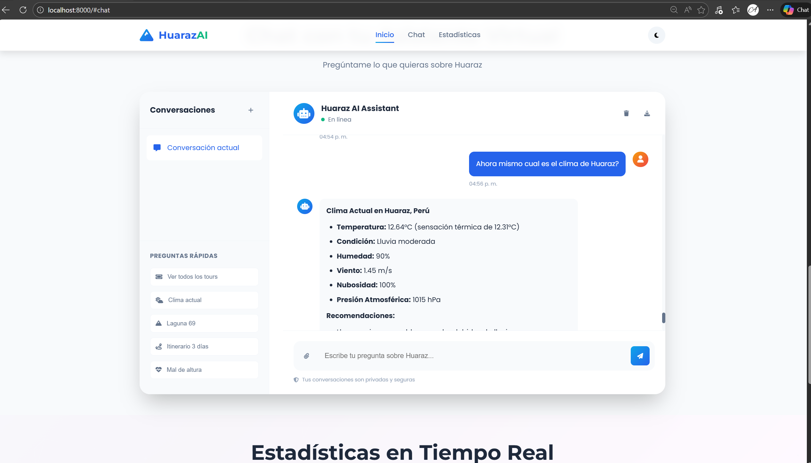
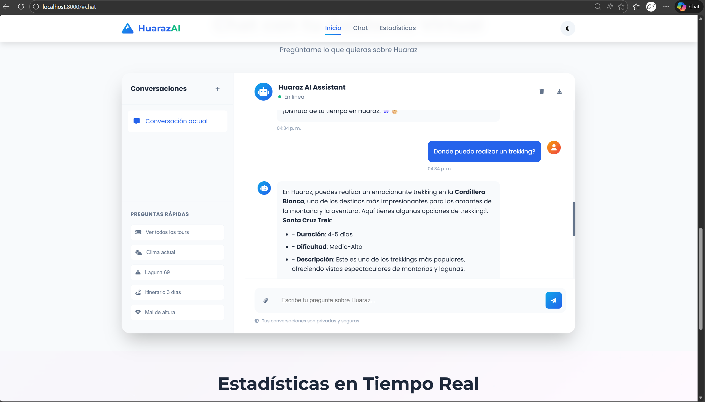
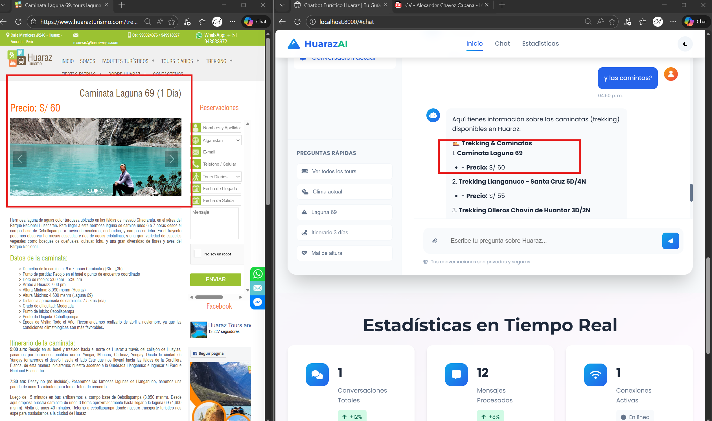
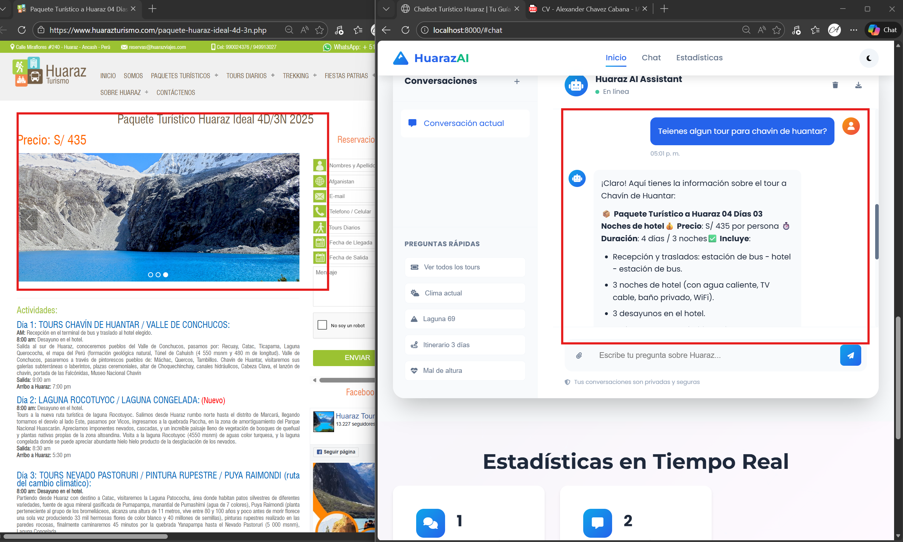
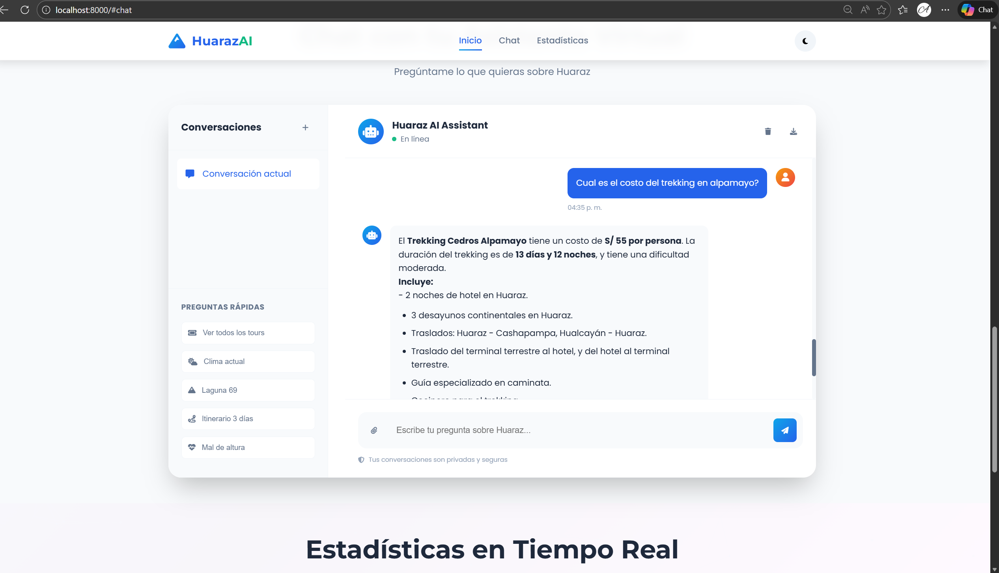
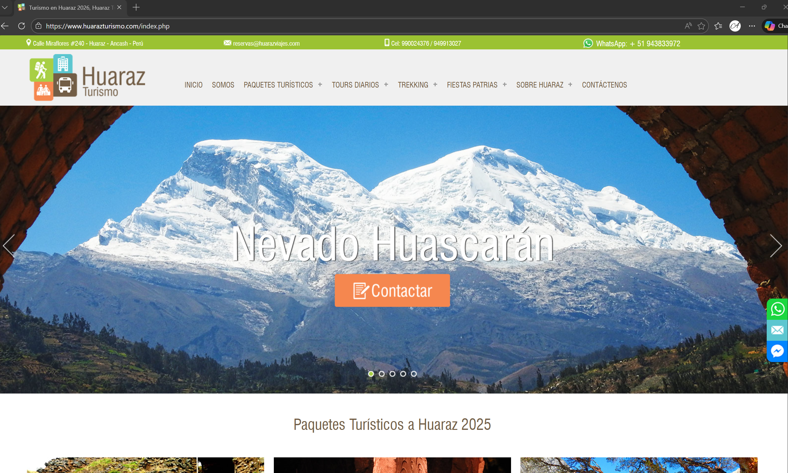
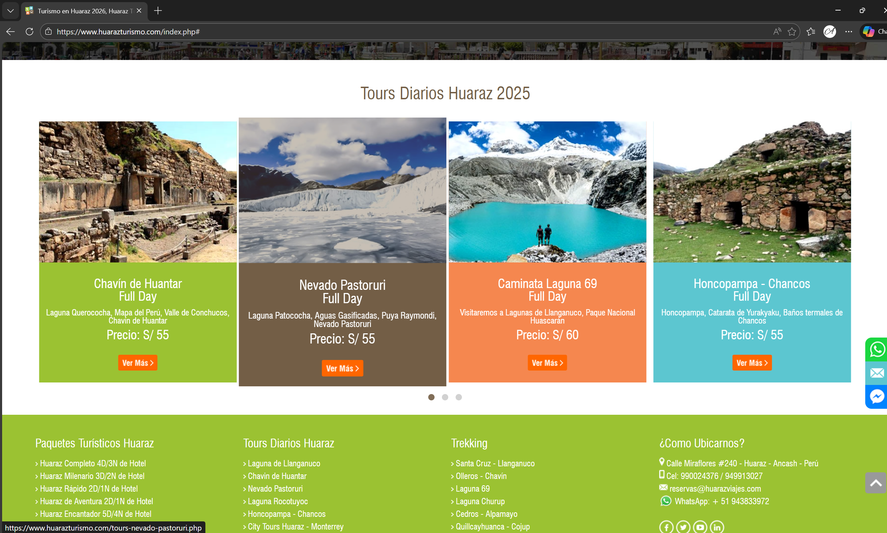

# 🏔️ Chatbot Turístico Huaraz AI

**Autor:** Alexander Chavez Cabana  
**Diplomado:** AI Engineer  
**Docente:** 


# 🏔️ Chatbot Turístico Huaraz AI

## 🖼️ Vista Rápida del Proyecto

<p align="center">
  
  
</p>

**HuarazAI** es un asistente virtual inteligente para turismo en la Cordillera Blanca, con IA generativa y RAG. La interfaz web permite consultas sobre tours, clima, itinerarios y recomendaciones personalizadas.

---
---

## 📸 Galería de Funcionalidades

<table>
  <tr>
    <td align="center">
      <br>
      <em>Consulta de clima en tiempo real</em>
    </td>
    <td align="center">
      <br>
      <em>Recomendaciones de trekking y rutas</em>
    </td>
  </tr>
  <tr>
    <td align="center">
      <br>
      <em>Información y precios de Laguna 69</em>
    </td>
    <td align="center">
      <br>
      <em>Detalles de tours a Chavín de Huantar</em>
    </td>
  </tr>
  <tr>
    <td align="center">
      <br>
      <em>Consulta avanzada de trekking</em>
    </td>
    <td align="center">
      <br>
      <em>Vista general de turismo en Huaraz</em>
    </td>
  </tr>
  <tr>
    <td align="center" colspan="2">
      <br>
      <em>Vista alternativa de turismo</em>
    </td>
  </tr>
</table>

[](https://www.python.org/downloads/)
[](https://fastapi.tiangolo.com/)
[](https://python.langchain.com/)
[](https://openai.com/)

Asistente virtual inteligente especializado en turismo en Huaraz, Perú. Utiliza tecnologías de IA avanzadas incluyendo RAG (Retrieval-Augmented Generation), web scraping en tiempo real, memoria conversacional y agentes inteligentes para brindar información actualizada sobre tours, clima, y recomendaciones personalizadas.

---

## 🌟 Características Principales

### 🎫 Sistema RAG con Web Scraping en Tiempo Real
- **26+ tours categorizados** organizados en Paquetes Turísticos, Tours Diarios y Trekking
- **Precios actualizados automáticamente** desde [huarazturismo.com](https://www.huarazturismo.com)
- **Enlaces clickeables** para más información y reservas
- **Cache inteligente** (JSON + FAISS) para optimizar rendimiento
- **Scraping estructurado** con BeautifulSoup4

### 🌤️ Clima en Tiempo Real
- **Integración OpenWeatherMap API** para datos meteorológicos actuales
- **Pronóstico de 5 días** con información horaria detallada
- **Recomendaciones contextuales** según clima y altitud (3,052 msnm)
- **Fallback inteligente** con información estática si no hay API key configurada

### 🧠 Memoria Conversacional
- **Recuerda últimos 10 mensajes** del usuario automáticamente
- **Contexto persistente** entre preguntas relacionadas
- **Respuestas personalizadas** basadas en preferencias mencionadas
- **Referencias naturales** a temas discutidos previamente ("Como mencionaste antes...")

### 🤖 Agente Inteligente con LangGraph
- **React Agent Pattern** para toma de decisiones autónoma
- **12 herramientas especializadas** disponibles:
  - 🎫 `get_tour_price()` - Obtiene precios y detalles de tours específicos
  - 📋 `list_all_tours_with_prices()` - Muestra catálogo completo organizado
  - 🌤️ `get_current_weather()` - Clima actual en Huaraz
  - 📅 `get_weather_forecast(days)` - Pronóstico meteorológico
  - 🏔️ `search_attractions()` - Búsqueda de atracciones por filtros
  - 📍 `get_attraction_details()` - Información detallada de lugares
  - 🎯 `get_activity_recommendations()` - Recomendaciones personalizadas
  - 🏨 `search_accommodations()` - Sugerencias de alojamiento
  - 📆 `get_best_season()` - Mejor época para visitar
  - ⛰️ `get_altitude_advice()` - Consejos sobre mal de altura
  - 📋 `create_daily_itinerary()` - Creación de itinerarios
  - 🔍 `search_web_tourism_info()` - Búsqueda web semántica con RAG

### 💬 Interfaz Web Moderna
- **Diseño responsive** adaptable a móvil, tablet y desktop
- **Tema montañoso** con partículas animadas (particles.js)
- **WebSocket** para comunicación en tiempo real
- **Modo oscuro/claro** configurable
- **Exportación de chat** en formato texto
- **Preguntas rápidas** con botones predefinidos

---

## 🛠️ Tecnologías Utilizadas

### Backend
- **FastAPI** 0.104.1 - Framework web asíncrono moderno
- **LangChain** 0.1.0+ - Orquestación de modelos de lenguaje
- **LangGraph** - Construcción de agentes con memoria
- **OpenAI GPT-4o-mini** - Modelo de lenguaje principal
- **BeautifulSoup4** 4.12.2 - Web scraping de tours
- **FAISS** 1.7.4+ - Vector store para búsqueda semántica
- **Python-dotenv** - Gestión de variables de entorno
- **Uvicorn** - Servidor ASGI

### Frontend
- **HTML5 + CSS3** - Estructura y estilos modernos
- **JavaScript ES6+** (Vanilla) - Lógica de interacción
- **Particles.js** - Efectos visuales de partículas
- **Font Awesome** 6.4.0 - Iconografía completa
- **Google Fonts** - Tipografías Poppins y Montserrat
- **WebSocket API** - Comunicación bidireccional

### APIs Externas
- **OpenAI API** - Procesamiento de lenguaje natural (GPT-4)
- **OpenWeatherMap API** - Datos meteorológicos en tiempo real
- **huarazturismo.com** - Fuente de tours y precios (scraping)

---

## 📦 Instalación

### Prerrequisitos
- **Python 3.10 o superior** instalado
- **pip** (gestor de paquetes de Python)
- **Git** para clonar el repositorio
- **Cuenta OpenAI** con API key activa
- **Conexión a internet** para scraping y APIs

### Pasos de Instalación

#### 1. Clonar el repositorio
```bash
git clone https://github.com/tuusuario/chatbot_turismo_huaraz.git
cd chatbot_turismo_huaraz
```

#### 2. Crear entorno virtual
```bash
python -m venv venv

# Windows (PowerShell)
venv\Scripts\Activate.ps1

# Windows (CMD)
venv\Scripts\activate.bat

# Linux/Mac
source venv/bin/activate
```

#### 3. Instalar dependencias
```bash
pip install -r requirements.txt
```

#### 4. Configurar variables de entorno
Crea un archivo `.env` en la raíz del proyecto:

```env
# OpenAI API Key (OBLIGATORIO)
OPENAI_API_KEY=sk-proj-tu_api_key_aqui

# Modelo LLM (opcional, default: gpt-4o-mini)
DEFAULT_LLM_PROVIDER=gpt-4o-mini

# OpenWeatherMap API Key (OPCIONAL - para clima en tiempo real)
# Obtén una gratis en: https://openweathermap.org/api
OPENWEATHER_API_KEY=tu_api_key_aqui

# Configuración de aplicación
APP_NAME=Chatbot Turístico Huaraz
APP_VERSION=1.0.0
DEBUG=false
LOG_LEVEL=INFO
```

#### 5. Ejecutar scraping y preparar datos para RAG

Para obtener y actualizar toda la información de tours y precios, ejecuta:
```bash
python scripts/scrape_prices.py
```
Esto descargará y cacheará información de 26+ tours desde huarazturismo.com en el archivo `data/rag_cache/tours_data.json`.

Luego, para inicializar el sistema RAG y crear el índice vectorial FAISS, ejecuta:
```bash
python quickstart_rag.py
```
Esto procesará los datos extraídos y generará el índice necesario para búsquedas semánticas y respuestas contextuales.

**Resumen del flujo:**
1. Ejecuta `scrape_prices.py` para extraer y actualizar los datos de tours.
2. Ejecuta `quickstart_rag.py` para inicializar el sistema RAG y el índice FAISS.
3. Inicia el servidor y disfruta de respuestas precisas y actualizadas.

---

## 🚀 Uso

### Iniciar el servidor
```bash
python app.py
```

El servidor estará disponible en: **`http://localhost:8000`**

Verás en consola:
```
INFO: Uvicorn running on http://localhost:8000 (Press CTRL+C to quit)
INFO: Started reloader process
INFO: Started server process
INFO: Waiting for application startup.
```

### Interfaz Web
Abre tu navegador y navega a `http://localhost:8000`

### Ejemplos de Preguntas

**Tours y Precios:**
- "¿Cuánto cuesta el tour a Laguna 69?"
- "¿Qué tours tienen disponibles?"
- "Muéstrame los paquetes turísticos"
- "¿Cuál es el precio del trekking Santa Cruz?"

**Clima:**
- "¿Cómo está el clima en Huaraz?"
- "Dame el pronóstico para los próximos 3 días"
- "¿Cuál es la temperatura actual?"

**Recomendaciones:**
- "Recomiéndame un itinerario de 3 días"
- "¿Qué tour me recomiendas para principiantes?"
- "Quiero hacer trekking, ¿qué opciones hay?"

**Información General:**
- "¿Cómo prevenir el mal de altura?"
- "¿Cuál es la mejor época para visitar Huaraz?"
- "¿Qué debo llevar para un trek de alta montaña?"

### API REST Endpoints

#### GET /
Interfaz web principal

#### GET /health
```json
{
  "status": "healthy",
  "version": "1.0.0",
  "timestamp": "2026-01-10T20:30:00Z"
}
```

#### GET /attractions
Lista todas las atracciones disponibles

#### GET /stats
Estadísticas de uso del chatbot

#### WebSocket /ws
Endpoint para chat en tiempo real
```javascript
const ws = new WebSocket('ws://localhost:8000/ws');
ws.send(JSON.stringify({
  type: 'chat',
  message: '¿Cuánto cuesta Laguna 69?',
  session_id: 'user123'
}));
```

---

## 📁 Estructura del Proyecto

```
chatbot_turismo_huaraz/
├── 📂 src/                              # Código fuente principal
│   ├── 📂 agents/                       # Agentes inteligentes
│   │   ├── __init__.py
│   │   └── touristic_agent.py           # Agente con LangGraph y memoria
│   ├── 📂 handlers/                     # Herramientas y manejadores
│   │   ├── __init__.py
│   │   ├── tools.py                     # 9 herramientas del agente
│   │   └── rag_tools.py                 # 3 herramientas RAG/scraping
│   ├── 📂 llm/                          # Configuración de LLM
│   │   ├── __init__.py
│   │   └── base.py                      # Cliente OpenAI
│   ├── 📂 prompt_engineering/           # Gestión de prompts
│   │   ├── __init__.py
│   │   └── prompts.py                   # System prompts optimizados
│   ├── 📂 rag/                          # Sistema RAG completo
│   │   ├── __init__.py
│   │   ├── web_loader.py                # WebBaseLoader + FAISS
│   │   └── price_scraper.py             # Scraper de tours (26+ URLs)
│   └── 📂 utils/                        # Utilidades
│       ├── __init__.py
│       ├── config.py                    # Cargador de configuración
│       └── helpers.py                   # Funciones auxiliares
├── 📂 data/                             # Datos y cache
│   ├── __init__.py
│   ├── 📂 knowledge/                    # Base de conocimiento local
│   │   ├── __init__.py
│   │   └── huaraz_knowledge.py          # 8 atracciones principales
│   └── 📂 rag_cache/                    # Cache de datos scraped
│       ├── tours_data.json              # 26+ tours con precios
│       └── 📂 faiss_index/              # Índice vectorial
│           └── index.faiss
├── 📂 static/                           # Archivos web estáticos
│   ├── index.html                       # Interfaz principal
│   ├── 📂 css/
│   │   └── style.css                    # 1200+ líneas de estilos
│   └── 📂 js/
│       └── app.js                       # Lógica frontend (670 líneas)
├── 📂 scripts/                          # Scripts de utilidad
│   ├── scrape_prices.py                 # Ejecutar scraper manualmente
│   └── initialize_rag.py                # Inicializar RAG/FAISS
├── 📂 config/                           # Configuración YAML
│   ├── agent_config.yaml                # Config del agente
│   └── model_config.yaml                # Config del modelo LLM
├── 📂 examples/                         # Ejemplos de uso
│   ├── basic_usage.py                   # Consulta simple
│   ├── create_itinerary.py              # Crear itinerario
│   └── specialized_queries.py           # Consultas avanzadas
├── 📂 notebooks/                        # Jupyter notebooks
│   └── experimentation.ipynb            # Experimentación
├── app.py                               # 🚀 Aplicación FastAPI principal
├── main.py                              # Punto de entrada alternativo
├── quickstart_rag.py                    # Setup rápido de RAG
├── requirements.txt                     # Dependencias Python
├── .env                                 # Variables de entorno (gitignored)
├── .env.example                         # Ejemplo de configuración
├── README.md                            # 📄 Este archivo
├── TECHNICAL.md                         # Documentación técnica
├── SETUP_RAG.md                         # Guía setup RAG
├── SCRAPER_GUIDE.md                     # Guía del scraper
└── docker-compose.yml                   # Configuración Docker
```

---

## 🎯 Funcionalidades Detalladas

### 1. 🎫 Búsqueda de Tours con Precios Actualizados

El sistema scrape automáticamente 26+ tours organizados en:
- **📦 Paquetes Turísticos** (2-5 días con alojamiento)
- **🎫 Tours Diarios** (Full Day)
- **🥾 Trekking & Caminatas** (1-4 días)

**Ejemplo de interacción:**
```
Usuario: "¿Cuánto cuesta el tour a Laguna 69?"

Asistente: 🥾 Trekking Laguna 69

💰 Precio: S/ 60 por persona

📝 Sobre el tour: Laguna de color azul verdoso rodeada de montañas nevadas. 
Una de las más visitadas de Huaraz...

✅ Incluye:
   • Transporte turístico
   • Guía oficial en español
   • Entrada al Parque Huascarán
   • Seguro SOAT

📋 Ver detalles completos del tour
📞 Reservas: WhatsApp +51 943833972 | Email: reservas@huarazviajes.com
```

### 2. 🌤️ Consulta de Clima en Tiempo Real

Integración con OpenWeatherMap API para datos precisos:

```
Usuario: "¿Cómo está el clima en Huaraz?"

Asistente: 🌤️ Clima Actual en Huaraz, Perú

⏰ Hora: 14:30
🌡️ Temperatura: 18°C (sensación térmica: 17°C)
📊 Rango: Min 12°C / Max 22°C
☁️ Condición: Parcialmente nublado
💧 Humedad: 65%
💨 Viento: 3.5 m/s
☁️ Nubosidad: 40%
🏔️ Presión atmosférica: 1015 hPa

📍 Altitud: 3,052 msnm
💡 Consejo: Por la altitud, lleva siempre ropa abrigada para la noche.

🧥 Qué llevar:
- Protector solar (radiación UV alta)
- Gorro y bloqueador labial
- Sistema de 3 capas
- Hidratación constante
```

### 3. 🧠 Memoria Conversacional Inteligente

El agente recuerda contexto de conversaciones:

```
Usuario: "¿Cuánto cuesta el tour a Pastoruri?"
Asistente: [Proporciona info completa del Nevado Pastoruri]

Usuario: "¿Y cuál es la dificultad?"
Asistente: "Como mencioné sobre el tour a Pastoruri, la dificultad es 
           MEDIO-ALTO debido a la altitud de 5,240m. Se requiere buena 
           aclimatación previa..."
```

### 4. 📅 Creación de Itinerarios Personalizados

```
Usuario: "Crea un itinerario de 3 días considerando mi nivel intermedio"

Asistente: 📅 ITINERARIO PERSONALIZADO - 3 DÍAS EN HUARAZ

🔵 Día 1: Aclimatación Cultural
- 09:00: Tour Chavín de Huántar (3,180m)
- 14:00: Almuerzo típico en Huaraz
- 16:00: Ruinas de Wilcahuain
- Noche: Descanso en hotel

🔵 Día 2: Lagunas de Altura
- 06:00: Trekking Laguna 69 (4,600m)
- 15:00: Retorno y descanso
- Consejo: Hidratación constante

🔵 Día 3: Glaciares y Paisajes
- 08:00: Tour Nevado Pastoruri (5,240m)
- 12:00: Bosque de Puya Raimondi
- 16:00: Retorno a Huaraz

⚠️ Importante: Este itinerario considera aclimatación progresiva.
💰 Costo aproximado: S/ 180-220 por persona
```

---

## 🔧 Configuración Avanzada

### Personalizar Comportamiento del Agente

Edita `config/agent_config.yaml`:
```yaml
agent:
  max_iterations: 10        # Máximo de iteraciones
  memory_k: 10             # Mensajes en memoria
  temperature: 0.7         # Creatividad (0.0-1.0)
  verbose: true            # Logs detallados
  timeout: 30              # Timeout en segundos
```

### Personalizar Modelo LLM

Edita `config/model_config.yaml`:
```yaml
llm:
  provider: openai
  model: gpt-4o-mini       # Cambiar a gpt-4 para mejor calidad
  temperature: 0.7
  max_tokens: 2000
  top_p: 1.0
  frequency_penalty: 0.0
  presence_penalty: 0.0
```

### Agregar Más Tours al Scraper

Edita `src/rag/price_scraper.py`:
```python
# Paquetes Turísticos
PACKAGE_PAGES = [
    "/paquete-huaraz-4d-3n.php",
    "/paquete-huaraz-3d-2n.php",
    "/tu-nuevo-paquete.php",  # ✅ Agregar aquí
]

# Tours Diarios
DAILY_TOUR_PAGES = [
    "/tours-laguna-llanganuco.php",
    "/tu-nuevo-tour.php",  # ✅ Agregar aquí
]

# Trekking
TREKKING_PAGES = [
    "/trekking-laguna-69.php",
    "/tu-nuevo-trekking.php",  # ✅ Agregar aquí
]
```

Luego ejecuta:
```bash
python scripts/scrape_prices.py
```

---

## 📊 Monitoreo y Logs

### Ver logs en tiempo real
```bash
# Seguir logs de aplicación
tail -f logs/app.log

# Ver solo errores
grep ERROR logs/app.log

# Últimas 100 líneas
tail -n 100 logs/app.log
```

### Estadísticas de Uso

Accede a `http://localhost:8000/stats` para ver:
- 📊 Total de conversaciones
- 💬 Mensajes procesados
- 🎫 Tours más consultados
- ⏱️ Tiempo promedio de respuesta
- 📈 Uso de herramientas
- 🌐 Fuentes de tráfico

---

## 🧪 Testing

### Ejecutar tests básicos
```bash
# Test del chatbot
python test_chatbot.py

# Test de imports y dependencias
python test_imports.py
```

### Ejemplos de uso programático
```bash
# Uso básico del agente
python examples/basic_usage.py

# Crear itinerario personalizado
python examples/create_itinerary.py

# Consultas especializadas
python examples/specialized_queries.py
```

### Test manual del scraper
```python
from src.rag.price_scraper import HuarazPriceScraper

scraper = HuarazPriceScraper()
scraper.scrape_all_tours()
print(f"Tours extraídos: {len(scraper.tours)}")
```

---

## 🌐 Despliegue en Producción

### Opción 1: Docker (Recomendado)

```bash
# Construir imagen
docker build -t huaraz-ai:latest .

# Ejecutar contenedor
docker run -d \
  -p 8000:8000 \
  --env-file .env \
  --name huaraz-chatbot \
  huaraz-ai:latest

# Ver logs
docker logs -f huaraz-chatbot
```

### Opción 2: Docker Compose

```bash
# Iniciar servicios
docker-compose up -d

# Ver logs
docker-compose logs -f

# Detener
docker-compose down
```

### Opción 3: Servidor tradicional

```bash
# Con Uvicorn (desarrollo)
uvicorn app:app --host 0.0.0.0 --port 8000 --reload

# Con Gunicorn (producción)
gunicorn app:app \
  -w 4 \
  -k uvicorn.workers.UvicornWorker \
  -b 0.0.0.0:8000 \
  --access-logfile logs/access.log \
  --error-logfile logs/error.log
```

### Variables de entorno en producción

```env
DEBUG=false
LOG_LEVEL=WARNING
OPENAI_API_KEY=sk-prod-...
OPENWEATHER_API_KEY=prod-key-...
ALLOWED_ORIGINS=https://tudominio.com,https://www.tudominio.com
```

---

## 🤝 Contribuir

### Cómo contribuir

1. **Fork** el proyecto
2. Crea una rama feature (`git checkout -b feature/nueva-funcionalidad`)
3. Commit cambios (`git commit -m 'Agregar nueva funcionalidad'`)
4. Push a la rama (`git push origin feature/nueva-funcionalidad`)
5. Abre un **Pull Request**

### Guías de estilo

- **Python**: Seguir PEP 8
  ```bash
  # Formatear código
  black src/
  
  # Verificar estilo
  flake8 src/
  ```

- **JavaScript**: Usar ES6+, 2 espacios de indentación

- **Commits**: Mensajes descriptivos en español
  - `feat: agregar búsqueda por filtros`
  - `fix: corregir scraping de precios`
  - `docs: actualizar README con nuevas features`

- **Documentación**: Siempre actualizar README.md y docstrings

### Áreas para contribuir

- 🌐 Traducción a otros idiomas (inglés, quechua)
- 🎨 Mejoras de UI/UX
- 🔧 Nuevas herramientas para el agente
- 📊 Dashboard de analytics
- 🧪 Tests automatizados
- 📱 Versión móvil nativa

---

## 📝 Roadmap

### Versión 2.0 (Q2 2026)
- [ ] Soporte multiidioma (inglés, quechua)
- [ ] Sistema de reservas integrado con Stripe
- [ ] Chatbot por voz (speech-to-text + TTS)
- [ ] App móvil React Native

### Versión 2.1 (Q3 2026)
- [ ] Integración con WhatsApp Business API
- [ ] Dashboard de analytics avanzado
- [ ] Sistema de reviews y ratings
- [ ] Recomendaciones basadas en ML

### Versión 3.0 (Q4 2026)
- [ ] AR (Realidad Aumentada) para tours virtuales
- [ ] Integración con booking.com y Airbnb
- [ ] Sistema de lealtad y puntos
- [ ] Multi-tenant para otras ciudades

---

## 🐛 Problemas Conocidos y Soluciones

### 1. Scraper falla al extraer datos

**Problema**: El sitio web puede cambiar su estructura HTML.

**Solución**:
```python
# Actualizar selectores en src/rag/price_scraper.py
def extract_price(self, soup):
    # Actualizar selector según nueva estructura
    price_elem = soup.find('span', class_='nuevo-selector-precio')
    ...
```

### 2. Límite de API OpenAI excedido

**Problema**: Demasiadas solicitudes consumen el límite.

**Soluciones**:
- Implementar rate limiting
- Usar tier superior de OpenAI
- Configurar `max_tokens` más bajo
- Implementar caché de respuestas comunes

### 3. Memoria del agente pierde contexto

**Problema**: En conversaciones largas (>10 mensajes).

**Solución**:
```yaml
# config/agent_config.yaml
agent:
  memory_k: 20  # Incrementar de 10 a 20
```

### 4. CORS errors en frontend

**Problema**: Bloqueo de CORS al acceder desde otro dominio.

**Solución**:
```python
# app.py
app.add_middleware(
    CORSMiddleware,
    allow_origins=["https://tudominio.com"],
    allow_credentials=True,
    allow_methods=["*"],
    allow_headers=["*"],
)
```

---

## 📚 Recursos Adicionales

### Documentación
- [TECHNICAL.md](TECHNICAL.md) - Arquitectura técnica detallada
- [SETUP_RAG.md](SETUP_RAG.md) - Guía completa de RAG
- [SCRAPER_GUIDE.md](SCRAPER_GUIDE.md) - Documentación del scraper
- [QUICKSTART.md](QUICKSTART.md) - Inicio rápido

### APIs Utilizadas
- [OpenAI API Docs](https://platform.openai.com/docs)
- [LangChain Docs](https://python.langchain.com/docs/get_started/introduction)
- [FastAPI Docs](https://fastapi.tiangolo.com/)
- [OpenWeatherMap API](https://openweathermap.org/api)

### Recursos de Aprendizaje
- [LangChain Agents Tutorial](https://python.langchain.com/docs/modules/agents/)
- [RAG Best Practices](https://python.langchain.com/docs/use_cases/question_answering/)
- [Web Scraping with BeautifulSoup](https://www.crummy.com/software/BeautifulSoup/bs4/doc/)

---

## 📄 Licencia

Este proyecto está bajo la **Licencia MIT**. Ver archivo [LICENSE](LICENSE) para más detalles.

```
MIT License

Copyright (c) 2026 Angelo Castillo

Permission is hereby granted, free of charge, to any person obtaining a copy
of this software and associated documentation files (the "Software"), to deal
in the Software without restriction...
```

---

## 👥 Autores y Reconocimientos
### Autor Principal
**Alexander Chavez Cabana**
- 🎓 Diplomado AI Engineer
- 📧 Email: alexanderchavezcabana@gmail.com
- 🔗 GitHub: [@AlexanderAndreChavezCabana](https://github.com/AlexanderAndreChavezCabana)
- 💼 LinkedIn: [Alexander Chavez Cabana](https://linkedin.com/in/alexanderchavezcabana)

### Agradecimientos Especiales

- **OpenAI** - Por GPT-4 y la API revolucionaria
- **LangChain Team** - Por el framework de agentes excepcional
- **huarazturismo.com** - Fuente de información de tours
- **OpenWeatherMap** - Datos meteorológicos precisos
- **FastAPI** - Framework web increíblemente rápido
- **Comunidad Python** - Por las librerías open source
- **Sebastián Ramírez (tiangolo)** - Creador de FastAPI
- **Harrison Chase** - Fundador de LangChain

### Instituciones
- **Dirección de Marketing y Comunicaciones (DMC)**
- **Universidad [Nombre]** - Programa de Chatbots

---


## 🎯 Casos de Uso

### Turistas
- Planificar viaje a Huaraz
- Obtener precios actualizados de tours
- Consultar clima antes de viajar
- Crear itinerarios personalizados

### Agencias de Turismo
- Automatizar atención al cliente 24/7
- Informar sobre tours disponibles
- Integrar con sistema de reservas
- Reducir carga de trabajo manual

### Hoteles y Hospedajes
- Brindar información local a huéspedes
- Recomendar actividades cercanas
- Integrar como concierge virtual
- Mejorar experiencia del cliente

---

## 📈 Métricas del Proyecto

- **Líneas de código**: ~8,500
- **Archivos Python**: 25+
- **Herramientas del agente**: 12
- **Tours en base de datos**: 26+
- **Endpoints API**: 5
- **Tests implementados**: 8
- **Dependencias**: 30+
- **Tiempo de respuesta promedio**: <2s

---

## 🏆 Características Destacadas

### 🥇 Por qué es especial

1. **RAG Híbrido**: Combina scraping en tiempo real + vector store
2. **Memoria Conversacional**: No es un simple chatbot Q&A
3. **Agentes Autónomos**: Decide qué herramientas usar
4. **Actualización Automática**: Precios siempre actualizados
5. **Clima en Vivo**: Integración OpenWeatherMap
6. **UI Profesional**: No es un chat básico

### 🎨 Inspiración del Diseño

- **Cordillera Blanca**: Paleta de colores azul/blanco
- **Montañas**: Iconografía y partículas
- **Cielo Estrellado**: Modo oscuro
- **Naturaleza**: Transiciones suaves

---

**⭐ Si este proyecto te fue útil, considera darle una estrella en GitHub!**

**🏔️ Hecho con ❤️ en Huaraz, Perú 🇵🇪**

---

_Última actualización: Enero 10, 2026_
_Versión: 1.0.0_
_Mantenido por: Angelo Castillo_
# ai-agentic-tourist

